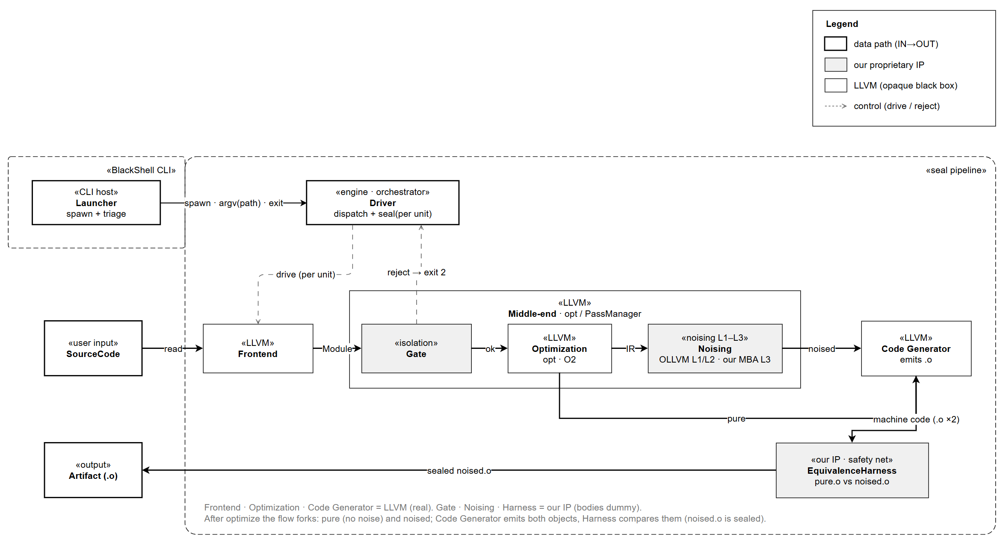
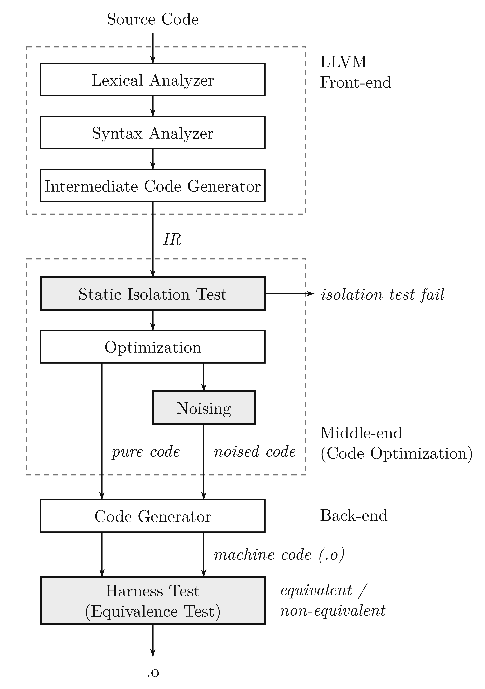

# BlackShell 아키텍처

> 엔진·파이프라인의 현재 구현 상태. 계층 계약은 [interfaces/](interfaces/).

---

## 1. 계층 개요

**외부는 TS Launcher, 실행은 C++ 엔진.** Launcher(`src/launcher/cli.ts`)가 CLI·명령셋·스테이징·렌더를
소유하고, 유닛마다 엔진 바이너리를 서브프로세스로 띄워 primitive(`check`/`enshell`)를 호출한다. 엔진은
파일명 없는 상태 코드 한 줄 + exit code만 돌려주고, 사용자 메시지는 Launcher가 스테이징 데이터로 src/obj를 채워 렌더한다.

**그림 1. 컴포넌트 계층.** 회색 = 우리 IP(Gate·Noising·EquivalenceHarness), 흰 박스 = LLVM 블랙박스/데이터 경로,
점선 화살표 = control/verify. IR(LLVM)은 엔진 안 primitive 사이를 **인메모리 `llvm::Module`**로 오간다.

---

## 2. enshell 파이프라인

봉인 본체(`driver_enshell`)는 핸드오프 체인 — 각 단계가 제 일을 하고 다음 단계를 직접 호출한다.
순서: `Clang → gate → optimize → (fork) → noising → codegen → harness`. Optimization 뒤에서
pure/noised로 갈라져 둘 다 `.o`로 emit되고, harness가 두 오브젝트를 비교한다.
noised.o = 봉인 산출물, pure.o = harness용 스크래치(검증 후 삭제). 등가검증은 플래그가 아니라 상시 내장이다.

**그림 2. enshell 파이프라인.** 흰색(frontend·Optimization·Code Generator·backend)은 전부 **진짜 연결**,
회색(gate·noising·harness)은 **바디만 더미**지만 flow는 통과한다. Optimization은 진짜 LLVM opt(O2),
harness는 두 `.o`를 받지만 바디는 아직 더미(`true`) — 진짜 링크·실행 비교는 실제 noising과 함께 들어온다.
Launcher의 `enshell`이 스테이징된 유닛마다 엔진 `enshell`을 한 번씩 호출하고 완료 후 스테이징을 비운다(1-shot).

---

## 3. 핵심 설계 원칙

- **경계** — Launcher가 명령셋을 소유, 엔진엔 `[subcommand, path]`(enshell은 `--level` 덧붙임) argv만 넘긴다.
  엔진은 bare 상태 코드 + exit code만, 렌더는 Launcher(`render()`). (`interfaces/01-cli-seam.md`)
- **primitive 계약** — 시그니처는 `src/engine/engine.hpp`. 각 primitive는 `.cpp` 하나로, 계약은 고정이고
  몸통은 그 파일에 격리된다. (`interfaces/04-pass-contract.md`)
- **더미 상태** — 우리 IP(게이트·노이징·하네스)는 전부 더미. identity noising = 보호 없음,
  accept-all gate = 어떤 유닛도 거부 안 함.
- **구조적 격리** — 외부 메모리 공유를 게이트가 판정하는 자리(현재 더미). (`interfaces/03-ir-model.md`)
- **등가 검증** — baseline(L0) vs 변환을 컴파일·실행해 관측 출력만 비교. 샘플 기반이라 반례 부재이지 증명은
  아니다. (`interfaces/05-verification-harness.md`)

---

## 4. 명령 → 구현 매핑

**Launcher 명령** (`src/launcher/cli.ts`):

| 명령 | 역할 | 구현 |
| --- | --- | --- |
| `check <source>` | 게이트 판정만(미리보기) | `cmdCheck` → 엔진 `check` |
| `add <source> [--level N]` | 유닛 스테이징 (N=1..3→누적 {L1..LN} 기록, 생략 시 3) | `cmdAdd` |
| `drop <source>` | 언스테이징 | `cmdDrop` |
| `list` | 스테이징 목록 | `cmdList` |
| `enshell` | 스테이징 전체 봉인 → 오브젝트 | `cmdEnshell` → 유닛마다 엔진 `enshell` |
| `help` / `-h` / 빈 argv | 사용법 | `USAGE` |
| `-v` / `--version` | 버전(엔진 없이 즉답) | `package.json` |

**엔진 subcommand** (`src/engine/`): `check` → `driver_check`(게이트만), `enshell` → `driver_enshell`(전체).

exit 코드: `0` 정상 · `1` 오류 · `2` 게이트 거부 · `127` 엔진 없음(Launcher가 설정).

> 레벨은 스테이징의 집합(`{L1..LN}`)으로 엔진 `enshell --level L1,L2`에 전달된다. 엔진 계약은 직교 집합을
> 유지하고(하네스 패스별 토글용), 더미 노이징은 레벨을 무시(identity). (`interfaces/02-driver.md`)

